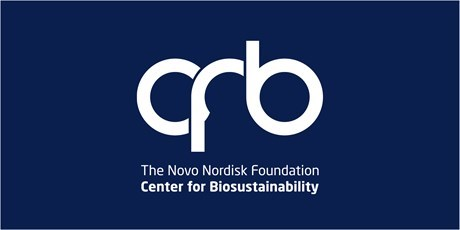

  

  

# Using Networks to Study Microbes

## Abstract
The goal of the course is to provide an introduction to the use of networks in microbiology. The students will receive an overview of the field of **computational microbiology** with special emphasis on data standardization* and data sources, and how to use graph structures to solve biological questions. Further, the students will get a hands on introduction to Python programming language and its scientific libraries. At the end of the course the students will be able to:
- Use multiple data sources for studying microbes in different biological contexts
- Build networks, visualize and analyse them using different tools
- Use Python to extract, transform and analyse different data structures

## Keywords
Computational microbiology, networks, databases, Python, programming, data, pipelines, data science.

## Sylabus

  
| Time                                                | DAY 1                                                | DAY 2                                                | DAY 3                                 |
|------------------------------------------------------|------------------------------------------------------|------------------------------------------------------|---------------------------------------|
|8:30-9:20| [Introduction and Housekeeping](slides/01_Intro.pdf) | [Working with Data in Python I]()                                    | [Analysing Networks I]() | 
|9:20-10:10| [An Omics View on Microbes I]()     |   [Working with Data in Python II]()              |                    |
|10:10-10:30| Coffee break                                         | Coffee break                                         | Coffee break                          |
|10:30-11:20| [An Omics View on Microbes II]()                             | [Visualizing Data in Python]()                                     | [Analysing Networks II]()       |
|11:20-12:10| [Open Science](slides/02_open_science.pdf)                           | [Visualising Networks I]()                                                     |                                       |
|12:10-13:30| Lunch                                                | Lunch                                                | Lunch                                 |
|13:30-14:20| [Introduction to Python I](https://colab.research.google.com/github/Multiomics-Analytics-Group/networks_to_study_microbes/blob/main/01_basics.ipynb)   | [Visualising Networks II]()                                     | [Team Project](Exercise)          |
|14:20-14:40| Coffee break                                         | Coffee break                                         | Coffee break                          |
|14:40-16:00| [Introduction to Python II]()                                       | [Network Exercises]()                                     | [Team Project]()          |
|16:00-16:50| Recap and Q & A                                                | Recap and Q & A                                                |   Team Project Presentations and Q&A                               |

## Further Resources

### References

1) [ALEdb 1.0: a database of mutations from adaptive laboratory evolution experimentation](https://pubmed.ncbi.nlm.nih.gov/30357390/) *Patrick V Phaneuf, Dennis Gosting, Bernhard O Palsson, Adam M Feist* [resource] (https://aledb.org/)

2) [MiMeDB: the Human Microbial Metabolome Database](https://pubmed.ncbi.nlm.nih.gov/36215042/) *David S Wishart, Eponine Oler, Harrison Peters, AnChi Guo, Sagan Girod, Scott Han, Sukanta Saha, Vicki W Lui, Marcia LeVatte, Vasuk Gautam, Rima Kaddurah-Daouk, Naama Karu* [resource](https://mimedb.org/)

3) [Web of microbes (WoM): a curated microbial exometabolomics database for linking chemistry and microbes](https://pubmed.ncbi.nlm.nih.gov/30208844/) *Suzanne M Kosina, Annette M Greiner, Rebecca K Lau, Stefan Jenkins, Richard Baran, Benjamin P Bowen, Trent R Northen* [resource](https://metatlas.nersc.gov/wom/project-begin.view)

4) [mBodyMap: a curated database for microbes across human body and their associations with health and diseases](https://pubmed.ncbi.nlm.nih.gov/34718713/) *Hanbo Jin, Guoru Hu, Chuqing Sun, Yiqian Duan, Zhenmo Zhang, Zhi Liu, Xing-Ming Zhao, Wei-Hua Chen* [resource](https://mbodymap.microbiome.cloud/)

5) [MicroPhenoDB Associates Metagenomic Data with Pathogenic Microbes, Microbial Core Genes, and Human Disease Phenotypes](https://pubmed.ncbi.nlm.nih.gov/33418085) *Guocai Yao, Wenliang Zhang, Minglei Yang, Huan Yang, Jianbo Wang, Haiyue Zhang, Lai Wei, Zhi Xie, Weizhong Li* [resource](http://www.liwzlab.cn/microphenodb)

6) [Rhea, the reaction knowledgebase in 2022](https://pubmed.ncbi.nlm.nih.gov/34755880/) *Parit Bansal, Anne Morgat, Kristian B Axelsen, Venkatesh Muthukrishnan, Elisabeth Coudert, Lucila Aimo, Nevila Hyka-Nouspikel, Elisabeth Gasteiger, Arnaud Kerhornou, Teresa Batista Neto, Monica Pozzato, Marie-Claude Blatter, Alex Ignatchenko, Nicole Redaschi, Alan Bridge* [resource](https://www.rhea-db.org/)

7) [BacDive in 2022: the knowledge base for standardized bacterial and archaeal data](https://pubmed.ncbi.nlm.nih.gov/34718743/)*Lorenz Christian Reimer, Joaquim Sardà Carbasse, Julia Koblitz, Christian Ebeling, Adam Podstawka, Jörg Overmann* [resource](https://bacdive.dsmz.de/)

8) [TEMPURA: Database of Growth TEMPeratures of Usual and RAre Prokaryotes](https://pubmed.ncbi.nlm.nih.gov/32727974/)*Yu Sato, Kenji Okano, Hiroyuki Kimura, Kohsuke Honda* [resource](http://togodb.org/db/tempura)

9) [Exposome-Explorer 2.0: an update incorporating candidate dietary biomarkers and dietary associations with cancer risk](https://pubmed.ncbi.nlm.nih.gov/31724701/) *Vanessa Neveu, Geneviève Nicolas, Reza M Salek, David S Wishart, Augustin Scalbert* [resource](http://exposome-explorer.iarc.fr/)

10) [HMDB 5.0: the Human Metabolome Database for 2022](https://pubmed.ncbi.nlm.nih.gov/34986597/) *David S Wishart, AnChi Guo, Eponine Oler, Fei Wang, Afia Anjum, Harrison Peters, Raynard Dizon, Zinat Sayeeda, Siyang Tian, Brian L Lee, Mark Berjanskii, Robert Mah, Mai Yamamoto, Juan Jovel, Claudia Torres-Calzada, Mickel Hiebert-Giesbrecht, Vicki W Lui, Dorna Varshavi, Dorsa Varshavi, Dana Allen, David Arndt, Nitya Khetarpal, Aadhavya Sivakumaran 1, Karxena Harford, Selena Sanford, Kristen Yee, Xuan Cao, Zachary Budinski, Jaanus Liigand, Lun Zhang, Jiamin Zheng, Rupasri Mandal, Naama Karu, Maija Dambrova, Helgi B Schiöth, Russell Greiner, Vasuk Gautam* [resource](https://hmdb.ca/)

11) [MASI: microbiota—active substance interactions database](https://www.ncbi.nlm.nih.gov/pmc/articles/PMC7779062/) *Xian Zeng, Xue Yang, Jiajun Fan, Ying Tan, Lingyi Ju, Wanxiang Shen, Yali Wang, Xinghao Wang, Weiping Chen, Dianwen Ju, and Yu Zong Chen* [resource](http://www.aiddlab.com/MASI/)

12) [MicroPhenoDB Associates Metagenomic Data with Pathogenic Microbes, Microbial Core Genes, and Human Disease Phenotypes](https://pubmed.ncbi.nlm.nih.gov/33418085/) *Guocai Yao, Wenliang Zhang, Minglei Yang, Huan Yang, Jianbo Wang, Haiyue Zhang, Lai Wei, Zhi Xie, Weizhong Li* [resource](http://www.liwzlab.cn/microphenodb)

13) [iModulonDB: a knowledgebase of microbial transcriptional regulation derived from machine learning](https://pubmed.ncbi.nlm.nih.gov/33045728/) *Kevin Rychel, Katherine Decker, Anand V Sastry, Patrick V Phaneuf, Saugat Poudel, Bernhard O Palsson* [resource](https://imodulondb.org/index.html)

14) [The Natural Products Atlas 2.0: a database of microbially-derived natural products](https://pubmed.ncbi.nlm.nih.gov/34718710/) *Jeffrey A van Santen, Ella F Poynton, Dasha Iskakova, Emily McMann, Tyler A Alsup, Trevor N Clark, Claire H Fergusson, David P Fewer, Alison H Hughes, Caitlin A McCadden, Jonathan Parra, Sylvia Soldatou, Jeffrey D Rudolf, Elisabeth M-L Janssen, Katherine R Duncan, Roger G Linington* [resource](https://www.npatlas.org/)

15) [MIBiG 3.0: a community-driven effort to annotate experimentally validated biosynthetic gene clusters](https://pubmed.ncbi.nlm.nih.gov/36399496/) *Barbara R Terlouw, Kai Blin, Jorge C Navarro-Muñoz, ..., Dong Yang, Jingwei Yu, Mitja Zdouc, Zheng Zhong, Jérôme Collemare, Roger G Linington, Tilmann Weber, Marnix H Medema* [resource](https://mibig.secondarymetabolites.org/)

16) [The National Microbiome Data Collaborative: enabling microbiome science](https://pubmed.ncbi.nlm.nih.gov/32350400/) *Elisha M Wood-Charlson, Anubhav, Deanna Auberry, Hannah Blanco, Mark I Borkum, Yuri E Corilo, Karen W Davenport, Shweta Deshpande, Ranjeet Devarakonda, Meghan Drake, William D Duncan, Mark C Flynn, David Hays, Bin Hu, Marcel Huntemann, Po-E Li, Mary Lipton, Chien-Chi Lo, David Millard, Kayd Miller, Paul D Piehowski, Samuel Purvine, T B K Reddy, Migun Shakya, Jagadish Chandrabose Sundaramurthi, Pajau Vangay, Yaxing Wei, Bruce E Wilson, Shane Canon, Patrick S G Chain, Kjiersten Fagnan, Stanton Martin, Lee Ann McCue, Christopher J Mungall, Nigel J Mouncey, Mary E Maxon, Emiley A Eloe-Fadrosh* [resource](https://data.microbiomedata.org/)

### Cheat Sheets
- Basics:
  - [Getting started](cheat_sheets/cheat_sheet_day0.pdf)
  - [Importing Data](cheat_sheets/Importing_Data_Cheat_sheet.pdf)
  - [Jupyter Notebook](cheat_sheets/Jupyter_Notebook_Cheat_Sheet.pdf)
- Data Science:
  - [Numpy](cheat_sheets/Numpy_Python_Cheat_Sheet.pdf)
  - [Pandas](cheat_sheets/Pandas_Cheat_Sheet.pdf)
  - [Scipy](cheat_sheets/Scipy-LinearAlgebra_Cheat_Sheet.pdf)
  - [Scikit-learn](cheat_sheets/Scikit-learn_Cheat_Sheet.pdf)
- Visualization:
  - [Matplotlib](cheat_sheets/Python_Matplotlib_Cheat_Sheet.pdf)
  - [Plot.ly](cheat_sheets/Plotly_Cheat_Sheet.pdf)
  - [Seaborn](cheat_sheets/Seaborn_Cheat_Sheet.pdf)
  - [Bokeh](cheat_sheets/Bokeh_Cheat_Sheet.pdf)

### Basics
- [learnpython.org](https://www.learnpython.org/)
  - interactive python basics tutorial

- [Springboard - Data Analysis with Python, SQL, and R](https://www.springboard.com/learning-paths/data-analysis/learn/)
  - starts with - [Solo Learn](https://www.sololearn.com/Course/Python/) and [Design of Computer Programs](https://www.udacity.com/course/design-of-computer-programs--cs212)
- [Scipy Lectures](https://scipy-lectures.org/index.html)
    - Python introduction with a focus on scientific computing
- [official tutorial](https://docs.python.org/3/tutorial/)

### Python Installations

In this course we use [Google Colab](https://colab.research.google.com/) to execute notebooks. Notebooks are text files allowing the combination of Text, Code and the output of code. Colab offers an extended set of pre-installed tools. See the [tutorial series](https://www.youtube.com/playlist?list=PLQY2H8rRoyvyK5aEDAI3wUUqC_F0oEroL).

[Anaconda](https://www.anaconda.com/products/individual) offers for your private computer an extended installations, including most tools you will ever need for Python.

